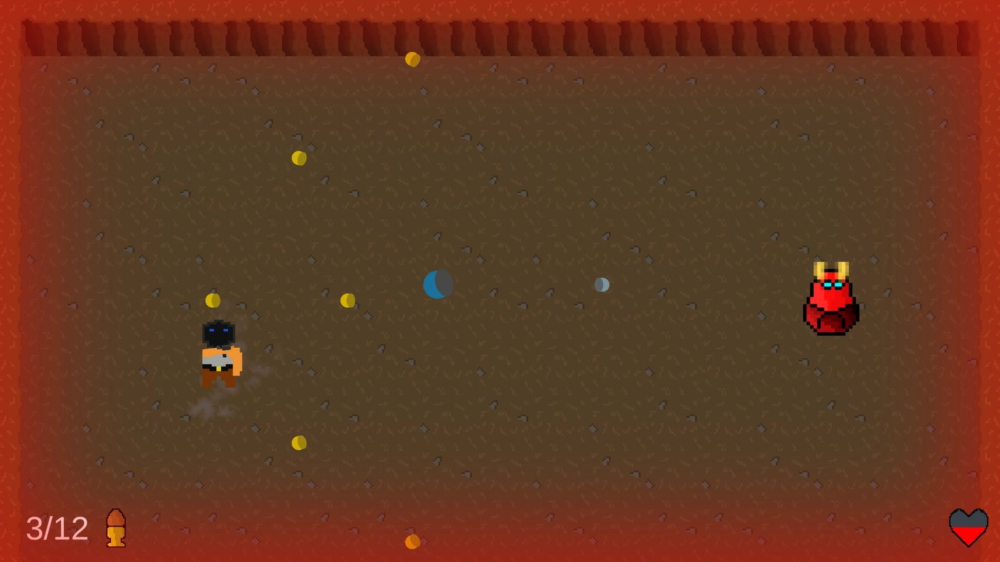

# BossFight

A small top-down 2D boss fight made in Unity with C#. I made it around 2021-22. A friend ([leonardzz7](https://github.com/leonardzz7)) also contributed to the repo.

**Status:** finished as a small project. In 2026 I upgraded it to Unity 6 and fixed the movement so it no longer depends on the frame rate, but otherwise the code is as it was.

## The game

You fight one boss in a closed arena. You move with **WASD**, aim with the mouse, shoot with **left click**, reload with **R** and dash with **Space**.

The boss picks a random attack after a short random delay:

- **Jump:** it jumps up, a marker shows where it will land, and it slams down with a camera shake and damage in a radius around the landing point.
- **Circle attack:** it sprays rings of bullets out around itself, a few times in a row, with the angle offset a bit each time so there are no safe spots that stay safe.
- **Following bullet:** a bullet that homes in on the player.

Each attack can be turned on and off in the inspector, which made it easy to test them one at a time.

## Running it

Open the `BossMechanic` folder in Unity 6 (6000.4) and play the `BossFight` scene. It was originally made in Unity 2021.1.

## Looking back

The code is small (five scripts, about 570 lines), and there are things I would do differently today. Most of the boss logic sits in one script, attacks are picked by number in a `switch` instead of being separate classes, and some comments are in Danish. But it is a complete loop: an arena, a boss with three attacks, health bars, a win screen and a lose screen.
